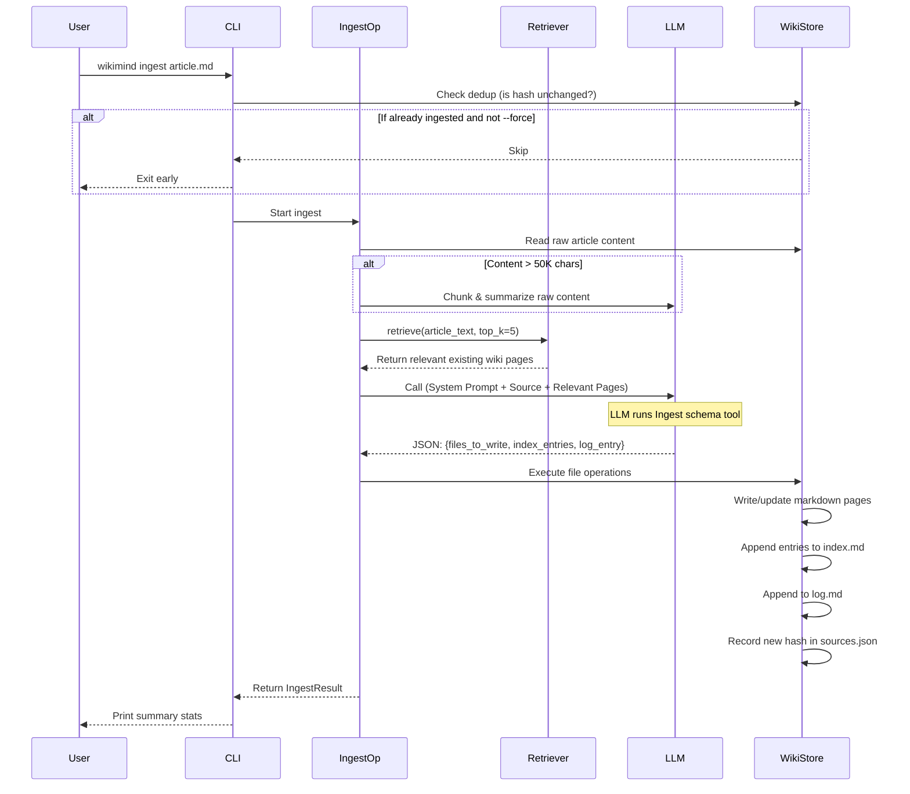
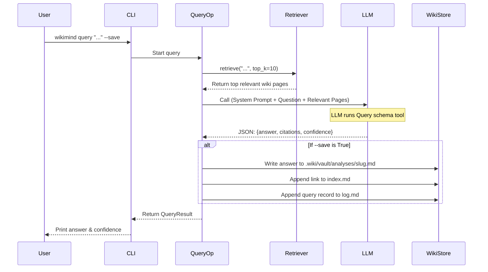

# WikiMind Architecture & Data Flow

This document explains how WikiMind operates, from high-level architecture down to specific data flows for CLI operations and MCP tools.

---

## 1. Overview Architecture

WikiMind is a local, filesystem-first Python application. It operates without a database, using markdown files and YAML frontmatter as its source of truth.

It has two primary ways of being invoked:
1. **CLI Mode**: Direct terminal commands (`wikimind ingest`, `query`, `lint`).
2. **MCP Server Mode**: Used by an AI Agent (like Claude Code) to interact with the wiki autonomously.

### Core Components

- **WikiStore (`wiki.py`)**: The storage layer. Handles all read/write operations to `.wiki/raw/` and `.wiki/vault/`. Handles wikilink resolution, index/log updates, and dedup tracking (`sources.json`).
- **Retrieval (`retrieval.py`)**: Responsible for finding relevant wiki pages for a given query. Supports pluggable backends (`bm25` full-text search or `index_keyword` match).
- **LLM Client (`llm.py` + `llm_schema.py`)**: Connects to Anthropic, OpenAI, or Ollama. Uses strict tool-calling (structured JSON output) to ensure the LLM returns parseable instructions instead of raw text.
- **Operations (`operations/`)**: The business logic for `ingest`, `query`, and `lint`.
- **MCP Server (`server.py`)**: A FastMCP server exposing WikiStore operations to AI clients.

---

## 2. Data Flow: Ingest Process

When you run `wikimind ingest .wiki/raw/article.md`, the following sequence occurs:

---

## 3. Data Flow: Query Process

When you run `wikimind query "What are the key themes?" --save`, the following sequence occurs:

---

## 4. MCP Tools & Data Flow

When an AI Agent (like Claude Code) connects to WikiMind via MCP, it runs the `wikimind serve` process in the background. The agent autonomously decides which tools to call.

Because MCP tools are stateless, the Agent acts as the orchestrator (replacing `operations/ingest.py` or `query.py`).

### Standard Agent Workflow via MCP

1. Agent receives a prompt: *"Ingest the new research paper."*
2. Agent calls `wiki_read_index` to see what the wiki currently knows.
3. Agent reads the raw paper from the filesystem (using its native tools, not WikiMind).
4. Agent calls `wiki_search(query="paper topics")` to find related existing wiki pages.
5. Agent calls `wiki_read_page(path="...")` for detailed context.
6. Agent synthesizes the new information internally.
7. Agent calls `wiki_write_page` multiple times to create/update concept and entity pages.
8. Agent calls `wiki_update_index` to link the new pages.
9. Agent calls `wiki_append_log` to record its actions.

### Tool Boundaries

All MCP tools map directly to `WikiStore` methods. They do **not** invoke the `LLMClient`. The Agent itself is the LLM.

- **`wiki_status`**: Returns `WikiStore` stats (page count, uningested source count).
- **`wiki_read_index`**: Returns content of `.wiki/vault/index.md`.
- **`wiki_search(query, top_k)`**: Uses the configured `Retriever` (e.g., BM25) to return full text of the top `k` relevant pages.
- **`wiki_list_pages()`**: Returns an array of valid relative paths.
- **`wiki_read_page(path)`**: Reads `.wiki/vault/<path>`. Rejects paths containing `../` or absolute paths.
- **`wiki_write_page(path, content)`**: Writes to `.wiki/vault/<path>`. Rejects path traversal. Requires YAML frontmatter in content.
- **`wiki_update_index(add, remove)`**: Mutates `.wiki/vault/index.md`.
- **`wiki_append_log(entry)`**: Appends to `.wiki/vault/log.md`.
