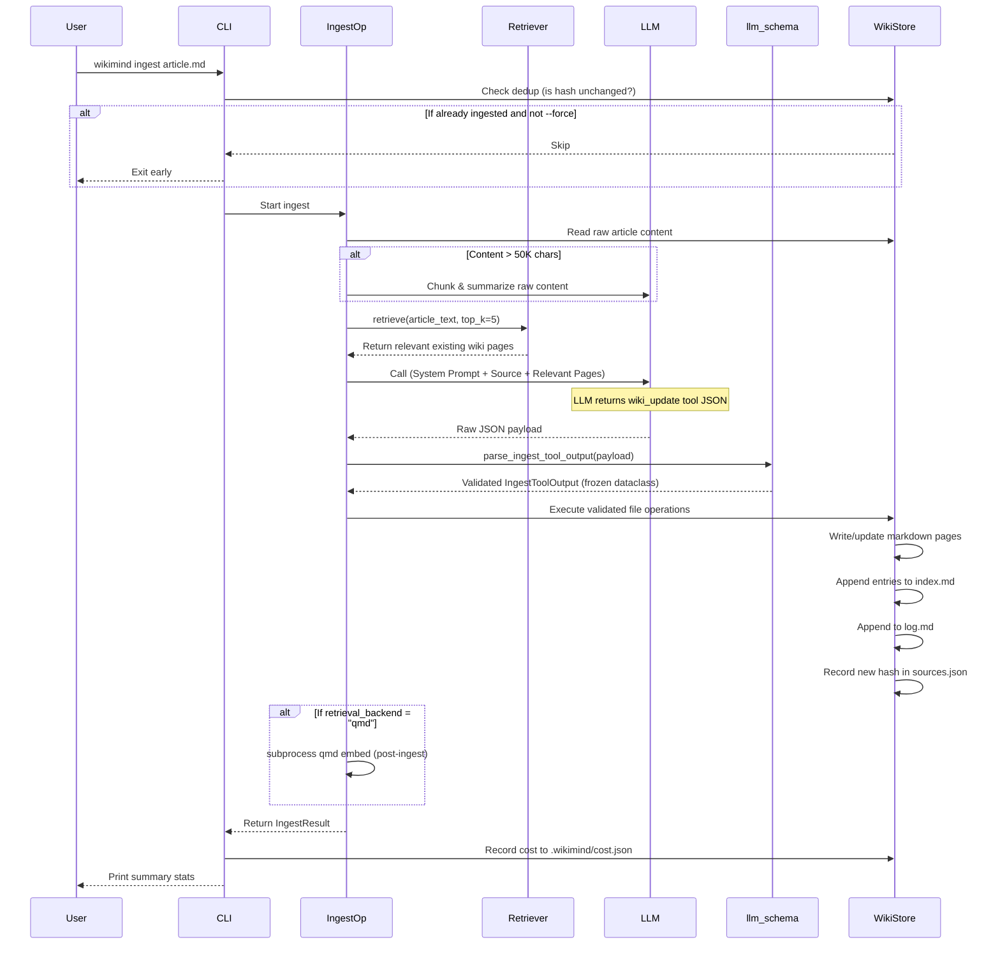
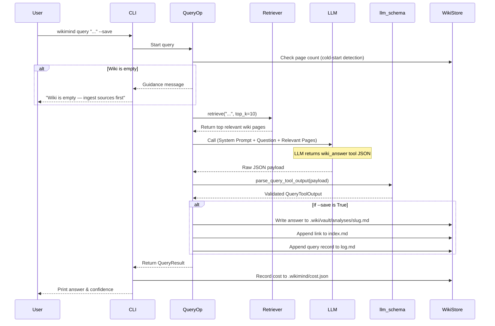
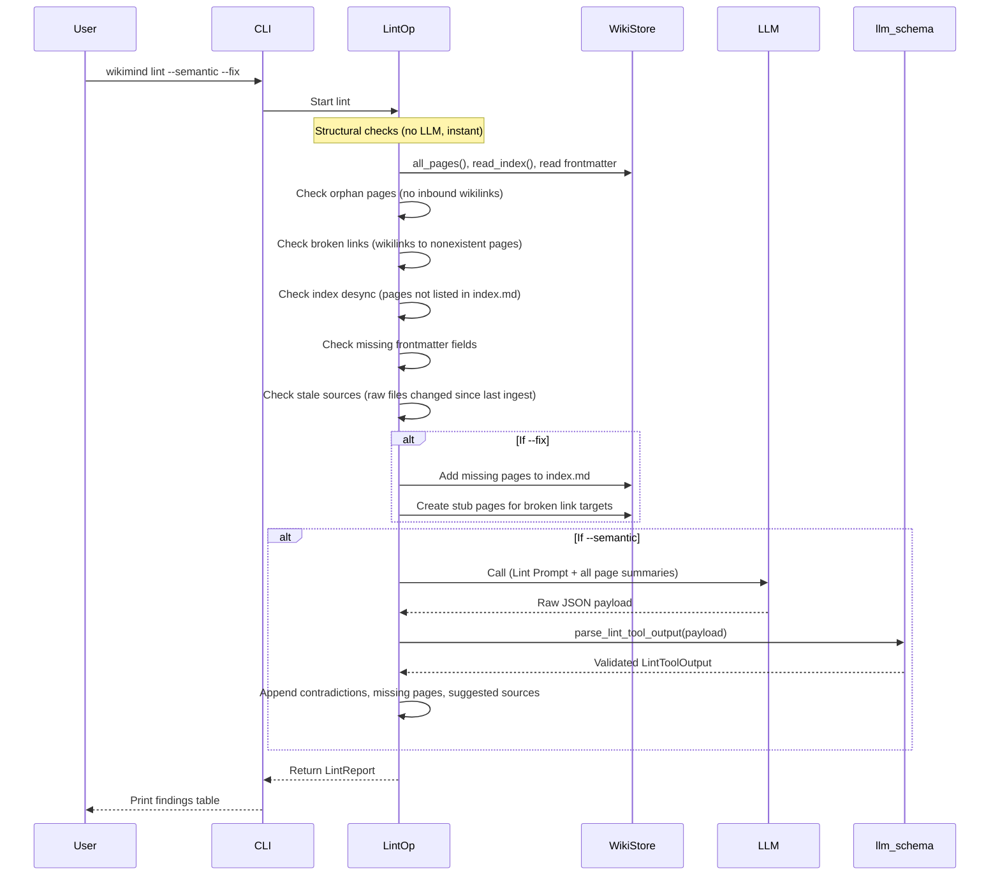

# WikiMind Architecture & Data Flow

This document explains how WikiMind operates, from high-level architecture down to specific data flows for CLI operations and MCP tools.

---

## 1. Overview Architecture

WikiMind is a local, filesystem-first Python application. It operates without a database, using markdown files and YAML frontmatter as its source of truth.

It has two primary ways of being invoked:
1. **CLI Mode (Mode B)**: Direct terminal commands (`wikimind ingest`, `query`, `lint`). WikiMind's own `LLMClient` calls the configured provider API.
2. **MCP Server Mode (Mode A)**: Used by an AI Agent (like Claude Code) to interact with the wiki autonomously. The agent IS the LLM — the MCP server exposes only filesystem operations.

Both modes write to the same wiki directory and are fully compatible.

### Three-Layer Data Model

```
Layer 1: Raw Sources (.wiki/raw/)       — User writes, LLM reads (immutable)
Layer 2: Wiki (.wiki/vault/)            — LLM writes, user reads (markdown + YAML frontmatter)
Layer 3: Schema (CLAUDE.md + wikimind.toml) — User + LLM co-evolve
```

### Core Components

```
wikimind/
├── cli.py              CLI entry point (Typer) — routes commands to operations
├── config.py           TOML config loader + typed dataclasses
├── wiki.py             WikiStore — all filesystem operations (CRUD, index, log, dedup)
├── llm.py              LLMClient + ProviderAdapter interface + 3 concrete adapters
├── llm_schema.py       Typed validation for LLM tool outputs (frozen dataclasses)
├── retrieval.py        Retriever protocol + 3 backends (keyword, BM25, qmd)
├── server.py           FastMCP server — 8 tools + background qmd embed threading
├── operations/
│   ├── ingest.py       Source → wiki pages (single LLM call)
│   ├── query.py        Question → answer with citations (single LLM call)
│   └── lint.py         Structural checks (no LLM) + semantic checks (one LLM call)
├── prompts/
│   ├── ingest.py       System prompt + wiki_update tool schema
│   ├── query.py        System prompt + wiki_answer tool schema
│   └── lint.py         System prompt + wiki_lint_report tool schema
└── templates/          Init templates (general, code, research, book)
```

### Component Dependency Graph

```
CLI ──→ Operations ──→ LLMClient ──→ ProviderAdapter (Anthropic/OpenAI/Ollama)
 │          │              │
 │          ├──→ Retriever (KeywordIndex / BM25 / Qmd)
 │          │
 │          └──→ WikiStore ──→ Filesystem (.wiki/vault/, .wiki/raw/, .wikimind/)
 │
 └──→ Config (wikimind.toml)

MCP Server ──→ WikiStore (direct)
    │
    ├──→ Retriever (for wiki_search)
    │
    └──→ Background qmd embed thread (for wiki_write_page)
```

**Key boundary:** The MCP server has **no LLMClient**. In Mode A, the AI assistant IS the LLM. The server only exposes file operations and search.

---

## 2. Provider Adapter Pattern

The `LLMClient` delegates provider-specific API details to a `ProviderAdapter` interface:

```
LLMClient
 ├── budget guard (max_budget_usd)
 ├── token tracking (per-session + persistent cost.json)
 └── adapter.call_tool() → (payload_dict, input_tokens, output_tokens)

ProviderAdapter (ABC)
 ├── AnthropicAdapter  — Claude API with native tool_use blocks
 ├── OpenAIAdapter     — Chat Completions API with function calling (raw urllib)
 └── OllamaAdapter     — Local /api/chat with schema-constrained JSON (raw urllib)
```

All adapters implement the same `call_tool()` interface, returning a structured JSON payload. OpenAI and Ollama adapters use raw `urllib` to avoid adding SDK dependencies.

---

## 3. Typed Output Validation

Every LLM response passes through typed validation before being applied to the filesystem. This prevents malformed LLM output from corrupting the wiki.

```
LLM Response (raw JSON)
    │
    ▼
parse_*_tool_output()  ← llm_schema.py
    │
    ├── Field-level type checks (str, list, dict)
    ├── Required field enforcement
    ├── Path traversal validation (_validate_relative_wiki_path)
    └── Action enum validation (create/update)
    │
    ▼
Frozen Dataclass (IngestToolOutput / QueryToolOutput / LintToolOutput)
    │
    ▼
Operations apply validated output to WikiStore
```

Validation dataclasses:
- `IngestFileWrite` — single file write instruction (path, content, action)
- `IngestToolOutput` — full ingest result (files_to_write, index entries, log entry, summary)
- `QueryToolOutput` — answer, citations, confidence, knowledge_gaps
- `LintContradiction` — pages involved + description
- `LintToolOutput` — contradictions, missing_pages, suggested_sources

---

## 4. Retrieval Backend Architecture

WikiMind uses a `Retriever` protocol with three interchangeable backends, selected via `retrieval_backend` in `wikimind.toml`:

```
Retriever (Protocol)
 │  def retrieve(query, top_k) → dict[str, str]  # {rel_path: content}
 │
 ├── KeywordIndexRetriever  — keyword overlap on index.md (~50 pages)
 ├── BM25Retriever          — Okapi BM25 full-text over all pages (~200 pages, default)
 └── QmdRetriever           — subprocess to qmd CLI for hybrid/semantic search (200+ pages)
```

**Factory function:** `make_retriever(store, backend, wiki_config)` creates the right backend from config. If `backend = "qmd"` but qmd is not installed, automatically falls back to BM25 with a warning.

### QmdRetriever Details

```
QmdRetriever.retrieve("machine learning", top_k=10)
    │
    ├── Lazy-resolve command prefix (handles Windows .CMD wrapper detection)
    ├── subprocess.run([qmd_bin, mode, query, "--json"], timeout=60)
    │     mode = "vsearch" (default) | "search" | "query"
    ├── Parse JSON output → [{file: "qmd://wiki/path", ...}]
    ├── Strip qmd:// URI prefix → wiki-relative path
    └── Read full content from disk (qmd snippet is excerpt, not full text)
```

Windows compatibility: detects npm `.CMD` wrappers and routes through Git's `sh.exe` to avoid shell compatibility issues.

---

## 5. Data Flow: Ingest Process

When you run `wikimind ingest .wiki/raw/article.md`, the following sequence occurs:



---

## 6. Data Flow: Query Process

When you run `wikimind query "What are the key themes?" --save`, the following sequence occurs:



---

## 7. Data Flow: Lint Process

`wikimind lint` runs structural checks without an LLM. With `--semantic`, it adds one LLM call for deeper analysis.



---

## 8. MCP Server Architecture

### Tool Boundaries

All MCP tools map directly to `WikiStore` methods. They do **not** invoke the `LLMClient`. The Agent itself is the LLM.

| Tool | Operation | Notes |
|------|-----------|-------|
| `wiki_status` | `WikiStore` stats | page count, source count, unprocessed sources |
| `wiki_read_index` | Read `index.md` | Agent should call this first |
| `wiki_search(query, top_k)` | `Retriever.retrieve()` | Uses configured backend (BM25/qmd/keyword) |
| `wiki_list_pages()` | `WikiStore.all_pages()` | Returns JSON array of relative paths |
| `wiki_read_page(path)` | `WikiStore.read_page()` | Auto-retries with `.md` extension; rejects `../` |
| `wiki_write_page(path, content)` | `WikiStore.write_page()` | Triggers background qmd embed |
| `wiki_update_index(add, remove)` | `WikiStore.update_index()` | Add/remove index entries |
| `wiki_append_log(entry)` | `WikiStore.append_log()` | Chronological record |

### Path Security

Both `WikiStore` and MCP tools enforce path traversal protection via `_resolve_wiki_relative_path()`:
- Rejects absolute paths
- Rejects `../` traversal
- Normalizes backslashes to forward slashes

### Background qmd Embed Threading (MCP Server)

When `retrieval_backend = "qmd"`, the MCP server maintains a background threading pattern to keep the qmd search index current without blocking tool responses:

```
wiki_write_page(path, content)
    │
    ├── WikiStore.write_page()      ← synchronous, blocks until written
    ├── Set _embed_dirty = True     ← under _embed_lock
    └── _trigger_embed()            ← fire-and-forget
            │
            └── if dirty AND no thread running:
                    start daemon thread → _run_embed()
                        ├── Clear _embed_dirty (before subprocess, so
                        │   mid-embed writes re-set the flag)
                        ├── subprocess.run(["qmd", "embed"], timeout=120)
                        └── Clear _embed_thread reference

wiki_search(query, top_k)
    │
    ├── _wait_for_embed()           ← blocks until background thread finishes
    │                                  (no-op if no thread running)
    └── retriever.retrieve(query)   ← searches with up-to-date index
```

This ensures search results reflect recently written pages without blocking write operations.

### Standard Agent Workflow via MCP

1. Agent receives a prompt: *"Ingest the new research paper."*
2. Agent calls `wiki_read_index` to see what the wiki currently knows.
3. Agent reads the raw paper from the filesystem (using its native tools, not WikiMind).
4. Agent calls `wiki_search(query="paper topics")` to find related existing wiki pages.
5. Agent calls `wiki_read_page(path="...")` for detailed context.
6. Agent synthesizes the new information internally.
7. Agent calls `wiki_write_page` multiple times to create/update concept and entity pages.
8. Agent calls `wiki_update_index` to link the new pages.
9. Agent calls `wiki_append_log` to record its actions.

---

## 9. Cost Tracking & Budget Guard

```
LLMClient.call()
    │
    ├── Budget check: if session_cost > max_budget_usd → raise LLMError
    ├── adapter.call_tool() → (payload, input_tokens, output_tokens)
    ├── Accumulate session totals (input_tokens, output_tokens, cost_usd)
    └── Return payload

CLI command completes
    │
    └── Append record to .wikimind/cost.json:
        { command, model, input_tokens, output_tokens, cost_usd, timestamp }

wikimind cost
    │
    └── Read .wikimind/cost.json → print table of last N records + all-time totals
```

---

## 10. Dedup & Content Hashing

```
.wikimind/sources.json
    { "normalized/source/path": { "hash": "sha256...", "ingested_at": "ISO8601" } }

wikimind ingest source.md
    │
    ├── Compute SHA-256 of source content
    ├── Normalize source path (cross-platform key: forward slashes, relative)
    ├── Look up in sources.json
    │     ├── Same hash → skip (already ingested, unchanged)
    │     └── Different hash or missing → proceed with ingest
    └── After successful ingest → write new hash + timestamp to sources.json
```

`--force` flag bypasses the hash check and re-ingests regardless.

---

## 11. Filesystem Layout

```
project-root/
├── wikimind.toml            # Project config (provider, model, paths, retrieval backend)
├── CLAUDE.md                # Schema/instructions for AI assistants
├── .mcp.json                # MCP server config for Claude Code
│
└── .wiki/
    ├── raw/                 # Layer 1: immutable source documents
    │   ├── article.md
    │   └── paper.pdf
    │
    ├── vault/               # Layer 2: LLM-generated wiki
    │   ├── index.md         # Master catalog (LLM reads this first)
    │   ├── log.md           # Append-only change history
    │   ├── overview.md      # High-level synthesis
    │   ├── entities/        # People, orgs, tools, systems
    │   ├── concepts/        # Ideas, theories, patterns
    │   ├── sources/         # One summary per raw source
    │   └── analyses/        # Saved query answers
    │
    └── .wikimind/           # Operational metadata
        ├── sources.json     # Dedup tracking {path: {hash, ingested_at}}
        ├── cost.json        # Cumulative token/cost history
        └── server.log       # MCP server log file
```
